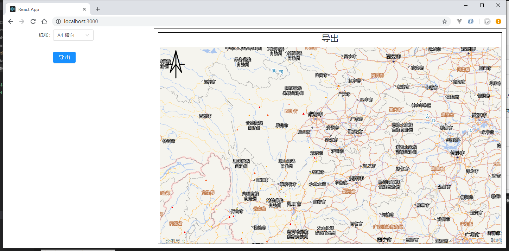

This project was bootstrapped with [Create React App](https://github.com/facebook/create-react-app).

## Available Scripts

In the project directory, you can run:

### `npm start`

Runs the app in the development mode. 
Open [http://localhost:3000](http://localhost:3000) to view it in the browser.

The page will reload if you make edits. 
You will also see any lint errors in the console.

## 地图导出

例子比较粗糙，不喜勿喷

支持天地图、arcgis服务以及GraphicLayer的图片导出；   
原本打算用antd和dva写的，愣是没写下去😂；直接上jquery了。。。

主要方法在`utils/printUtil.js、utils/calcUtil.js`

GraphicLayer在ie中的支持，请引入canvg.js，这里提供一个测试testIE.html，可用于查看问题;  
例子中没有绘制图形相关内容请自行添加测试，但是方法中已经支持，按照要求传入即可

### print方法使用

例子中使用位置`containers/App.js`

### 本例子界面以及结果

- 界面    

- 结果  

### 过程

wmts服务添加到map后arcgisapi会根据当前视图计算用于显示瓦片，并通过二维变换让所有图片拼接显示。这些变换的参数在图层对象中都能获取到，根据这些变换参数可以将瓦片手动拼成一张图片。功能主要解决的问题还是资源跨域问题，瓦片要转换为base64编码的图片，然后拼合成一张图片，最后在使用前端截图插件dom-to-image或html2canvas进行图片生成。

1、初始化map对象，div显示层级为负，设置map的中心点和比例尺  
2、添加底图和要素图形   

- 有wmts
为保证wmts服务的瓦片获取正确无误，必须全部添加到map上，监听每个服务的update-end事件，不添加arcgis服务
- 无wmts
arcgis服务只需添加一个即可，我们只是需要map初始化完成后的extent，监听服务的load事件

3、待上述事件全部抛出，开始打印准备，创建打印根节点元素(层级设为负)   

- wmts服务瓦片获取并转为base64，拼合做位置变换，完成后返回服务图片容器的元素节点
- arcgis服务export图片，dpi、bbox、height、width、sr、visibleLayers，每个服务都要进行请求，都完成后返回服务图片容器的元素节点

4、将3中返回的元素加入打印根结点元素，克隆map中要素图层的svg元素，加入打印根节点元素  
5、使用截图插件出图，完成事件抛出
